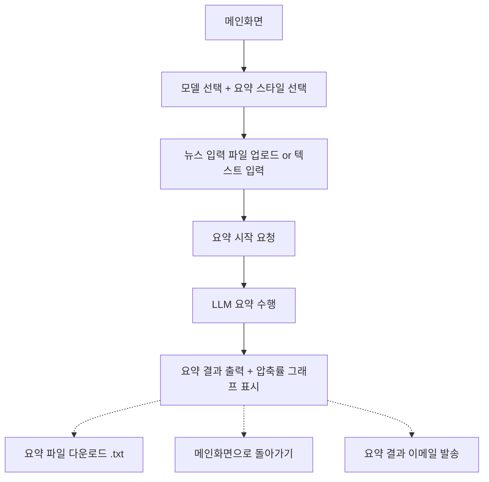
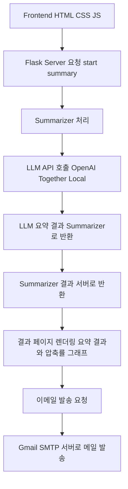

# 📰News.ai: LLM을 활용한 뉴스 요약 및 메일 발송 서비스 <br>

## ✨ 프로젝트 소개


**LLM(OpenAI API 등)을 활용하여 뉴스 기사를 요약하고, 요약 결과를 메일로 발송하는 자동화 서비스**입니다.<br>
(뉴스 직접 입력 또는 크롤링 → 요약 → 메일 전송)
<br>

---

## 📚 적용 디자인 패턴

| 디자인 패턴                             | 적용 위치                           | 기대 효과                                                     |
| :--------------------------------- | :------------------------------ | :-------------------------------------------------------- |
| **추상 팩토리 패턴** (Abstract Factory)   | 뉴스 요약 생성기 (GPT 요약, TextRank 요약) | 다양한 요약 알고리즘을 선택적으로 적용 가능<br>요약 방식 변경 시 코드 수정 최소화          |
| **옵저버 패턴** (Observer)              | 메일 전송 성공/실패 알림 처리               | 메일 전송 결과를 이벤트 기반으로 사용자에게 전달<br>발송 로직과 알림 로직을 분리           |
| **MVC 패턴** (Model-View-Controller) | 웹 구조화 (HTML, CSS)             | Model, View, Controller 분리<br>유지보수성과 확장성 향상  |
| **전략 패턴** (Strategy)               | 뉴스 요약 방식 선택 처리                  | 실행 시점에 다양한 요약 모델(GPT, TextRank 등)을 선택 가능<br>요약 모델 교체 용이 |
| **프록시 패턴** (Proxy)                 | 외부 API(OpenAI API) 호출 최적화       | API 호출 전에 요청 제한, 캐싱 등 부가기능 추가<br>API 부하 감소                |
| **템플릿 메서드 패턴** (Template Method)   | 뉴스 크롤링 프로세스 기본 구조 설계            | 기본 크롤링 로직은 고정하고, 사이트별 차이만 하위 클래스에서 구현<br>다양한 언론사 대응 가능    |

---


## 🛠️ 시스템 아키텍처

```plaintext
1. 뉴스 입력 (직접 입력 or 크롤링)
    ↓
2. 뉴스 요약 (OpenAI API, LLM 모델 등을 활용, 요약 팩토리를 통해 다양한 요약 지원)
    ↓
3. 메일 주소 입력
    ↓
4. 요약 결과를 메일로 전송
    ↓
5. 전송 성공 여부 알림 (옵저버 패턴)
```

--- 

<br>

## 👥 팀 역할 분담

| 역할        | 담당 업무                           | 비고                 |
| :-------- | :------------------------------ | :----------------- |
| 박우진 (PM)   | 프로젝트 관리, 전체 구조 설계, 뉴스 요약 API 연결 및 프롬프트 리팩토링, 웹 페이지 개발 | AI 모듈 구현 및 연결 담당, 발표자료 준비 |
| 이선기 | 뉴스 입력/크롤링 기능 개발 | 추상 팩토리 패턴 구현 담당, 발표자료 준비    |
| 엄이슬 | 메일 발송 기능 개발 + 전송 성공 알림 (옵저버 패턴) | Django 메일 모듈 활용 예정, 발표자료 준비 |

---

## 🎯 주요 기능

### 기본 기능

* 뉴스 가져오기 (직접 입력 or 크롤링)
* 입력된 뉴스 본문을 요약하여 결과 생성
* 입력한 메일 주소로 요약 결과 발송
* 전송 성공 여부를 검사하고 사용자에게 알림 표시

### 부가 기능

* 관심 키워드 또는 관심 언론사 설정
* 일/주/월 단위 주요 토픽 뉴스 추천
* 오늘의 뉴스 (뉴스 헤드라인 - 제목 누르면 해당 뉴스 웹 페이지로 이동) 

---


## 🗺️ UI 플로우



## 🏗️ 시스템 구조도 (Backend API 흐름)



---

## 📂 프로젝트 디렉토리 구조

```plaintext
news_summary/
├── 5월15일 아이디어.md              # 회의 아이디어 정리
├── 기능 명세서.md                   # 기능 정리 문서
├── 중간보고서.md                    # 프로젝트 중간 보고서
├── README.md                        # 프로젝트 설명 파일
├── app.py                           # Flask 서버 메인 파일
├── test.txt                         # 테스트용 입력 파일
│
├── static/                          # 정적 파일 (CSS, JS)
│   ├── css/
│   │   └── style.css                # 메인 스타일시트
│   └── js/
│       ├── script.js                # 타이핑 효과, 결과 표시용 스크립트
│       └── validate.js              # 입력 검증 및 진행 관리 스크립트
│
├── templates/                       # Flask 템플릿 폴더
│   ├── index.html                   # 메인 입력 페이지
│   ├── loading.html                 # 요약 로딩 중 페이지
│   └── result.html                  # 요약 결과 출력 페이지
│
├── summarizer/                      # 요약 관련 로직 모듈
│   ├── __init__.py
│   ├── summarizer_strategy.py       # Summarizer 추상 클래스 (전략 패턴)
│   ├── summarizer.py                # Summarizer 팩토리 및 메인 함수
│   ├── openai_summarizer.py         # OpenAI 기반 요약 클래스
│   ├── together_summarizer.py       # Together.ai 기반 요약 클래스
│   └── local_summarizer.py          # 로컬 LLM 기반 요약 클래스
└── __pycache__/                     # 파이썬 캐시 폴더
│
├── uploads/                         # 업로드된 뉴스 파일 저장 폴더
├── output/                          # 요약 결과 저장 폴더
└── __pycache__/                     # 파이썬 캐시 폴더
```

---

## 🏁 프로젝트 목표

**12주차 중간발표 (5/22)** 기준으로 **최소 기능(MVP) 완성과 체계적인 시스템 구조 설계**를 목표로 합니다.

최종 발표에서는

* MVP 기능 완성
* 향후 확장 방향성 (예: 사용자 맞춤형 뉴스 추천, 다양한 요약 모델 적용)
  을 함께 제시할 예정입니다.

---

## 🔗 레퍼런스

* [ChatGPT를 이용한 뉴스 요약](https://positive-impactor.tistory.com/626)
* [크롤링 후 뉴스 요약 (Teddylee 블로그)](https://teddylee777.github.io/python/news-article/)
* [주식 뉴스 요약 메일링 프로그램](https://myeonghak.github.io/natural%20language%20processing/NLP-주식-뉴스-요약-메일링-프로그램/)
* [NLP 활용 뉴스 요약 가이드](https://study-yoon.tistory.com/227)
* [News Summary - est.ai 블로그](https://blog.est.ai/2021/06/news-summary/)
* [파이썬 특정 키워드 네이버 뉴스 크롤링](https://wewegh.tistory.com/61)
* [파이썬 카테고리별 네이버 기사 크롤링](https://bigdata-doctrine.tistory.com/34)

