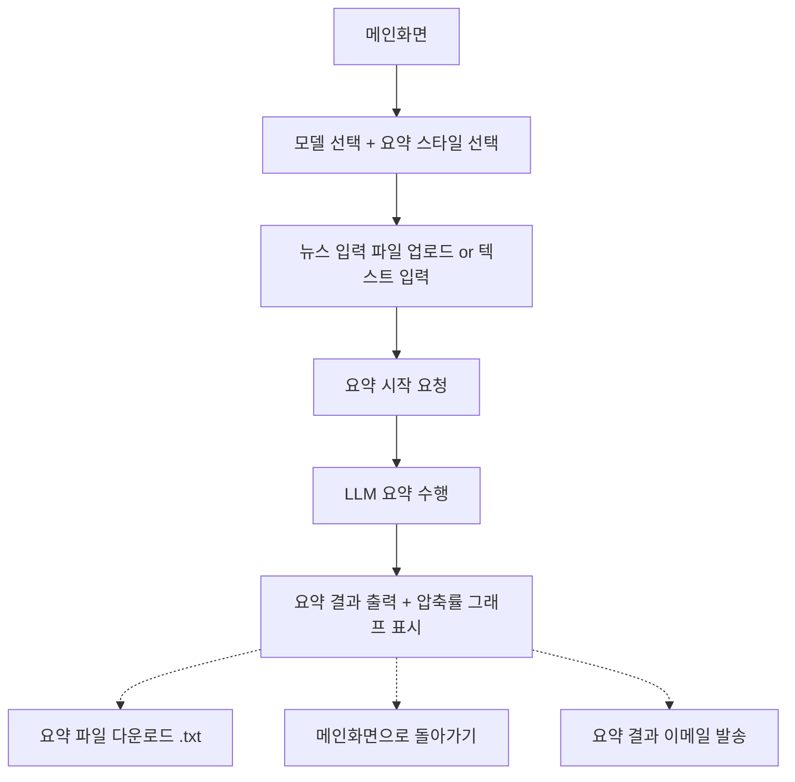
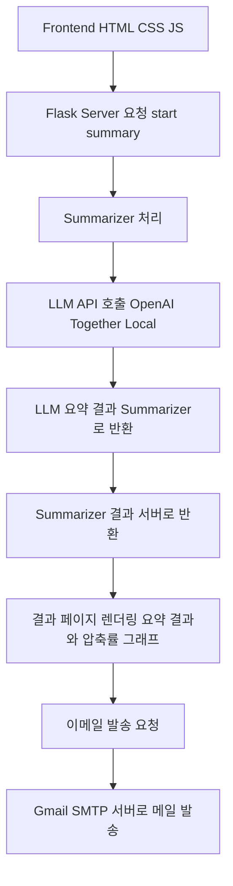

# 🌟 News.ai - 중간보고서

---

## 1. 서비스 개요

* **목적:**
  사용자가 뉴스 기사(텍스트 파일 업로드 또는 직접 입력)을 입력하면,
  선택한 LLM 기반 목록과 요약 스타일에 따라 뉴스 요약을 수행하고,
  요약 결과를 `.txt` 파일로 다운로드 하거나 이메일로 수신할 수 있는 서비스.

* **구성:**

  * 프론트엔드 (HTML/CSS/JavaScript)
  * 백엔드 서버 (Flask)
  * 외부 API (예: Perplexity.ai API, Together.ai API, Gmail SMTP 서버 등)

---

## 2. 주요 기능 목록

| 기능 구분     | 기능 설명                                         |
| :-------- | :-------------------------------------------- |
| LLM 목록 선택 | Perplexity.ai, Together.ai 목록, 로컬 LLM(예: Ollama) |
| 요약 스타일 선택 | 간격 요약 (3줄 이내) / 상세 요약 (5\~7줄)                 |
| 뉴스 입력     | `.txt` 파일 업로드 또는 텍스트 직접 입력                    |
| 진행률 표시    | Progress Bar + 퍼센트 수치 시각화                     |
| 요약 결과 출력  | 요약된 뉴스 문장 표시                                  |
| 압축률 그래프   | 원문 길이 vs 요약문 길이 Bar Chart 그래프                 |
| 요약파일 다운로드 | `.txt` 파일로 다운로드                               |
| 메인화면 이동   | 결과 페이지에서 메인화면으로 이동                            |
| 이메일 발송    | Gmail SMTP로 요약 파일 발송 (이메일 입력)                 |

---

## 3. 상세 플로우

### 1) 요약 시작 전

* 사용자가 **목록** 선택
* 사용자가 **요약 스타일** 선택
* 사용자가 **뉴스 파일 업로드** 또는 **텍스트 입력** 중 하나 선택

### 2) 요약 진행

* **"요약 시작"** 버튼을 누르면 서버에서 LLM 기반 요약 수행

### 3) 요약 완료 후

* **요약 결과 텍스트** 표시
* **압축률 그래프** 표시
* 사용자 선택:

  * 📄 요약 파일 `.txt` 다운로드
  * 🏠 메인화면 이동
  * 📧 요약 파일 이메일 발송

---

## 4. UI 플로우

---

## 5. 시스템 구조도 (Backend API 흐름)

---

## 6. 기능별 작업 담당자

| 기능                             | 담당자 |
| :----------------------------- | :-- |
| Github 및 프로젝트 관리        | 박우진 |
| Frontend (UI 구조, 입력 포맷)        | 박우진 |
| Backend (Flask server, API 조합) | 박우진 |
| Chart.js 구조 및 그래프 그리기          | 박우진 |
| LLM 연동 (Perplexity, Together.ai)과 프롬프트 구조                | 이선기 |
| 📧 요약 파일 이메일 발송 기능             | 엄이슬 |

---

# 🌟 요약

> 이 뉴스 요약 서비스는
> **"입력(파일/텍스트) → LLM 요약 → 결과 표시 + 이메일 발송"**
> 풀사이클을 갖춘 웹 기반 서비스이다.

---
